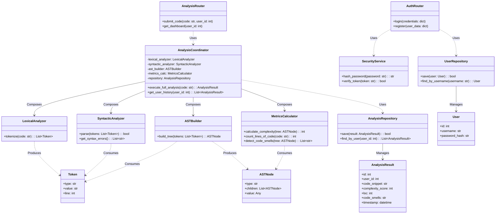

# Diagrama de Clases (Clean Architecture)

A continuación se detalla el diagrama de clases del sistema **Analizador Estático de Código con Métricas**, modelado bajo los principios de Clean Architecture. 

